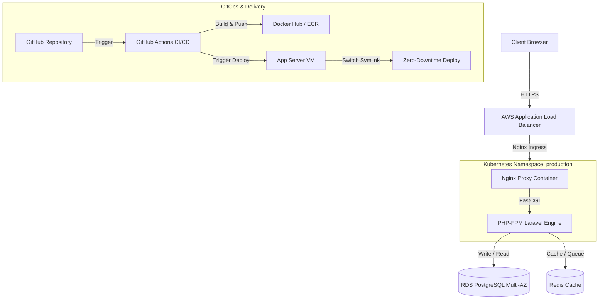

# Project Overview
This repository showcases an enterprise-grade, high-availability platform architecture designed for high-throughput SaaS applications. It integrates a containerized PHP/Laravel backend with modular Infrastructure as Code (IaC) on AWS, secure Kubernetes orchestration, and automated operational pipelines. The codebase showcases production engineering practices including multi-stage container optimization, zero-downtime VM symlink deployment scripting, automated GPG-encrypted backups, and isolated networking configurations.

---

## Architecture (Mermaid)



---

## Tech Stack
* **Backend Application**: PHP 8.2 (Laravel 10), PostgreSQL 15, Redis 7
* **Infrastructure as Code**: Terraform, AWS (VPC, RDS Multi-AZ, EC2, S3, IAM)
* **Containerization & Orchestration**: Docker, Docker Compose, Kubernetes, Helm
* **CI/CD & Automation**: GitHub Actions, Bash (Deploy/Backup scripting)
* **OS & Web Gateway**: Alpine Linux, Nginx, GPG, UFW Firewall

---

## Key Features
* **Multi-Stage Docker Optimization**: Alpine-based builder and runner stages that isolate build tools, resulting in a production runtime footprint under 120MB executed by a non-root (`www-data`) user.
* **Modular Infrastructure as Code**: Modular Terraform modules provisioning a secure two-tier VPC network, isolated database subnets, IAM role profiles, and RDS PostgreSQL with active synchronous standby replication.
* **Zero-Downtime Releases**: Custom shell scripting implementing Capistrano-style atomic symlink switching for VM environments, ensuring active TCP connections do not drop during deployments.
* **Hardened Kubernetes Quotas**: Kubernetes manifests declaring Namespace resources, CPU/Memory ResourceQuotas, default LimitRanges, and database pod NetworkPolicy rules restricting access only to application pods.
* **Automated Encrypted Backups**: Daily Cron automation tasks dumping databases, encrypting raw schema files with GPG public-key certificates, and syncing archives over SSH to remote targets.

---

## Folder Structure

```text
hiteshv253/
├── .github/workflows/        # GitHub Actions CI/CD workflow configurations
├── app/                      # Backend application core (health & telemetry endpoints)
├── docker/                   # Production Nginx server & OPcache configs
├── images/                   # Architecture diagrams and performance dashboards
├── kubernetes/               # Namespaces, NetworkPolicies, ResourceQuotas, and Helm configs
├── routes/                   # Routing configuration for application APIs
├── scripts/                  # Atomic deployment, GPG database backup, and restore scripts
├── terraform/                # Modular AWS IaC (VPC, RDS, IAM, S3, EC2 modules)
├── Dockerfile                # Multi-stage production container build configuration
├── docker-compose.yml        # Multi-container local integration configuration
├── LICENSE                   # MIT License
└── README.md                 # Project documentation
```

---

## Quick Start

### 1. Run Application Locally (Docker Compose)
Spins up Nginx, PHP-FPM, PostgreSQL, and Redis containers in an isolated network:
```bash
docker-compose up -d --build
```
Access the local endpoint at `http://localhost:8080/api/v1/healthz`.

### 2. Run Local Backup Verification
Test database dump execution, GPG encryption, and cleanup sequences locally:
```bash
chmod +x scripts/backup.sh
./scripts/backup.sh
```

---

## Deployment

### VM Symlink switching
Zero-downtime releases on standard virtual servers are handled via atomic directory swapping:
1. **Prepare Release**: Creates a new timestamped directory under `releases/YYYYMMDDHHMMSS`.
2. **Mount Shared Resources**: Points symlinks for `.env` and `/storage` back to the central `shared/` directory.
3. **Warm Caches**: Installs dependencies (`composer install --no-dev`) and pre-warms Laravel config/route caches.
4. **Switch Link**: Changes the `current` active symlink to point to the new directory.
5. **Reload Services**: Triggers graceful reloads (`systemctl reload php-fpm nginx`) without connection disruption.

---

## CI/CD

```text
[Commit Push] ➔ [PHPUnit Tests & Lints] ➔ [Docker Buildx Build] ➔ [ECR Push] ➔ [SSH VM Deploy]
```
The workflow `.github/workflows/deploy.yml` manages automated integration and delivery:
* **CI Suite**: Validates composer dependencies, configures PHP 8.2 environments, and runs Unit test suites.
* **CD Suite**: Builds multi-platform Docker images, pushes tags to ECR/DockerHub, connects to the destination host via SSH, pulls active images, and initiates the database migration and container reload pipeline.

---

## Screenshots
* **Deployment Topology**: Conceptual VPC and subnets segregation layout.
* **Pipeline Execution Logs**: Successful GitHub Actions run logs showing clean validation checkmarks.
* **Grafana Dashboards**: Real-time server telemetry showing container limits and CPU utilization.
* **Application API Telemetry**: JSON validation responses from health and metrics endpoints.

---

## Future Improvements
* **Secret Management Integration**: Replace `.env` configurations with AWS Secrets Manager or HashiCorp Vault key injection.
* **Continuous Security Scans**: Incorporate Trivy container image scanning and tfsec Terraform configuration checks into the CI workflow.
* **Centralized Log Aggregation**: Configure Promtail and Grafana Loki collectors to aggregate system and application logs.

---

## Author
* **Hitesh Kumar** - Senior Backend & DevOps Engineer
* **Email**: [hiteshv253@gmail.com](mailto:hiteshv253@gmail.com)
* **GitHub**: [Hiteshv253](https://github.com/Hiteshv253)
* **LinkedIn**: [Hitesh Kumar](https://linkedin.com/in/hiteshv253)
