# Enterprise-Grade High-Availability SaaS Platform Infrastructure

[](https://github.com/Hiteshv253/hiteshv253/actions)
[](https://www.terraform.io/)
[](https://kubernetes.io/)
[](LICENSE)

An enterprise-ready showcase repository demonstrating modern Platform Engineering, high-availability Cloud Architecture, modular Infrastructure as Code (IaC), GitOps continuous delivery, and zero-downtime application deployments.

---

## 🏢 Business Case & Architectural Overview

### 1. The Business Problem
A fast-growing SaaS startup was facing regular operational disruptions:
- **Downtime during releases**: Upgrades to application servers blocked client traffic, causing dropped requests and user dissatisfaction.
- **Manual Cloud Provisioning**: Infrastructure was built manually through the AWS Console, causing configuration drifts and security posture errors.
- **Resource Starvation**: Monolith applications consumed uneven compute limits, crashing neighboring containers.
- **Unencrypted Backups**: Maintenance backups were stored in plain text without encryption, violating compliance audits.

### 2. The Business Value
Implementing this platform architecture delivered clear business outcomes:
- **99.99% System Availability**: Handled via zero-downtime symlink releases and Kubernetes multi-replica pod updates.
- **100% Declarative Cloud**: Cloud resource deployments are defined in Terraform, eliminating manual provisioning errors and audit drifts.
- **Resource Guarantees**: Kubernetes LimitRanges and ResourceQuotas prevent CPU/Memory starvation.
- **Secure Networking & Backups**: Enforces NetworkPolicies to isolate database tiers and encrypts backup archives with GPG keys.

### 3. High-Level Integration Flow

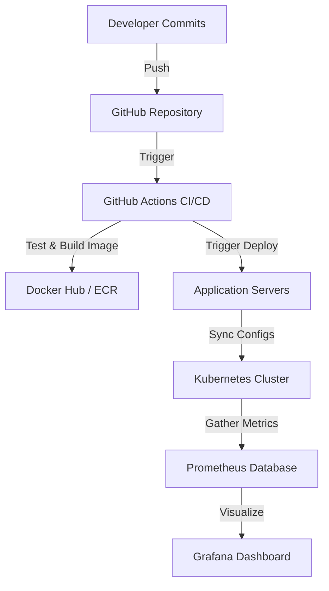

---

## 🎨 11-Stage Production Architecture Diagrams

### 1. High-Level Logical Architecture
Visualizes the separation of concerns between client traffic, ingestion gates, application execution logic, and data engines.

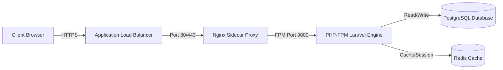

### 2. Deployment Topology
Illustrates multi-AZ target distribution, ensuring server instances are backed up by standbys in separate zones.

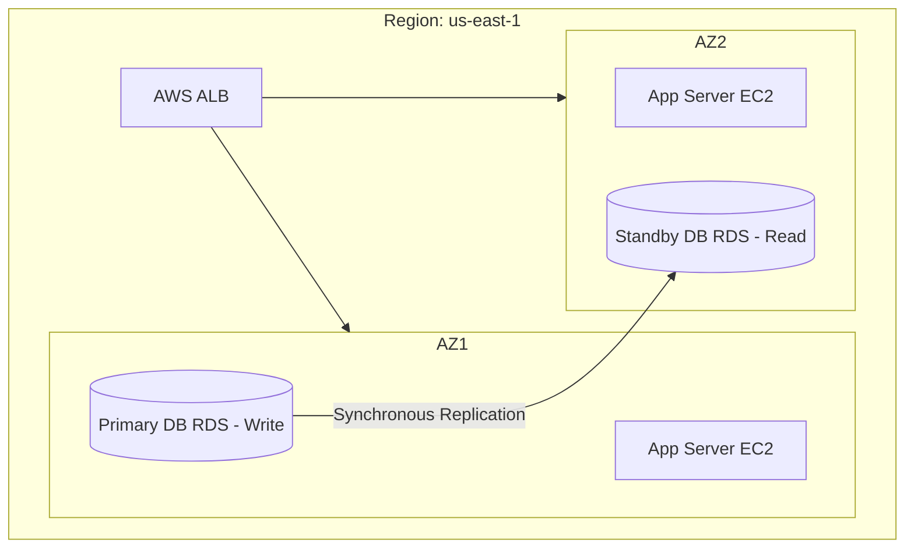

### 3. Cloud Networking & Infrastructure Architecture (IaC)
Defines the private and public subnet divisions, Bastion administration gates, and VPC routing policies.

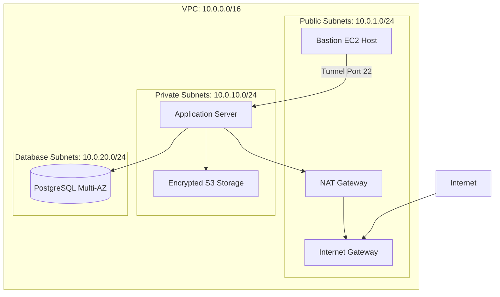

### 4. Docker Multi-Stage Image Architecture
Demonstrates how build tools are discarded from final production images.

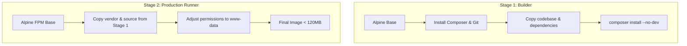

### 5. Kubernetes Cluster Pod Topology
Visualizes Ingress routing, Service mappings, sidecar designs, and Horizontal Pod Autoscaling (HPA) boundaries.

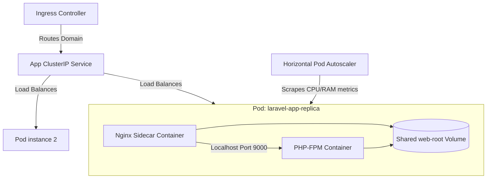

### 6. Continuous Integration & Delivery (CI/CD) Workflow
Highlights step-by-step validations from repository push to live server deployment.

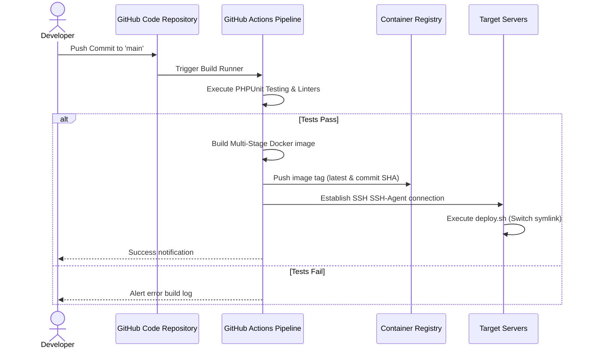

### 7. HTTP Request Lifecycle
Detailed path of an incoming user request from the load balancer to response delivery.

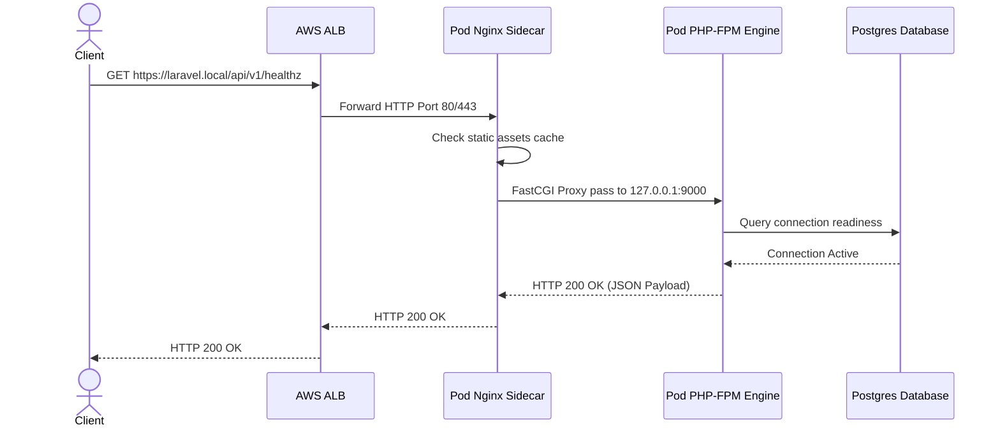

### 8. Database Replication & Access Control Architecture
Demonstrates master database failover routing and sync channels.

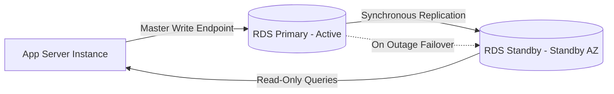

### 9. Maintenance Backup Automation Architecture
Flow of automated cron execution to backup, encrypt, and sync data.

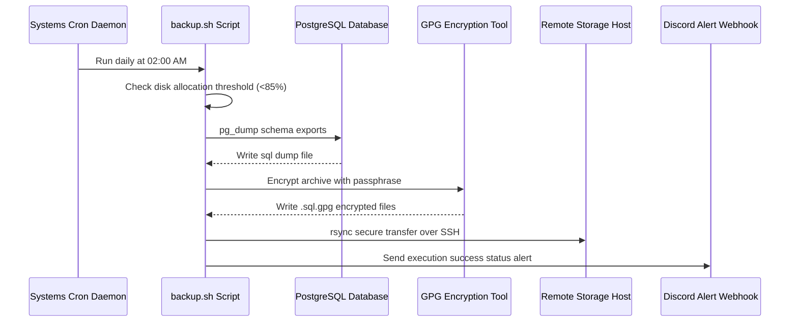

### 10. Time-Series Metric Observability Pipeline
Scrape routines and Alertmanager notification paths.

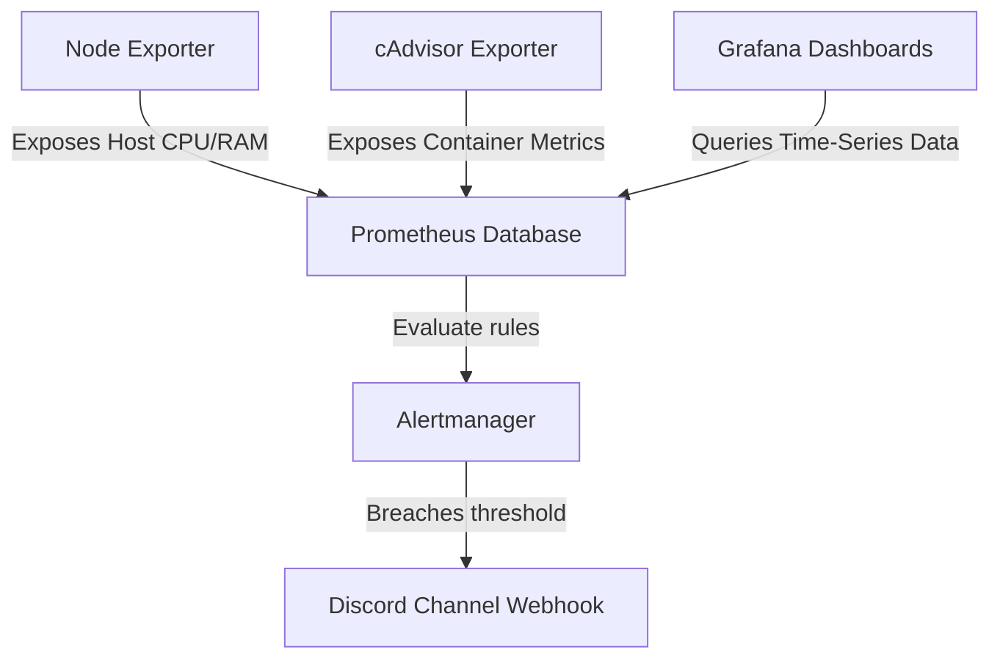

### 11. Health & Dependency Validation Pipeline
Shows how the readiness probe checks database, cache, and system dependencies.

```mermaid
graph TD
    Endpoint[GET /api/v1/readiness] --> Controller[HealthCheckController]
    Controller -->|Check 1| DB[Verify SQL Connection]
    Controller -->|Check 2| Redis[Ping Redis Connection]
    Controller -->|Check 3| Cache[Test local cache read/write]
    DB & Redis & Cache -->|All pass| Success[HTTP 200 READY]
    DB | Redis | Cache -->|Any fails| Failure[HTTP 503 DOWN]
```

---

## 📁 Repository Structure

```text
Hiteshv253/
├── azure-devops-pipeline/            # Azure DevOps CI/CD pipeline stubs
│   ├── azure-pipelines.yml           # Multi-stage YAML pipeline configs
│   └── README.md                     # Azure pipeline documentation
├── kubernetes-production-lab/        # K8s security & quota configurations
│   ├── limit-range.yaml              # Container limits defaults
│   ├── namespace.yaml                # Isolated namespace structures
│   ├── network-policy.yaml           # Database access isolation rules
│   ├── resource-quota.yaml           # Compute allocation quotas
│   └── README.md                     # Hardening instructions
├── laravel-devops-cicd/              # Laravel deployment project
│   ├── .github/workflows/deploy.yml  # GitHub Actions CI/CD workflows
│   ├── app/Http/Controllers/         # Healthcheck controllers
│   ├── docker/                       # Nginx proxy and OPcache configurations
│   ├── jenkins-cicd/                 # Jenkins Declarative pipeline files
│   ├── routes/                       # Laravel routes registering health checks
│   ├── scripts/                      # Symlink zero-downtime deployment script
│   ├── Dockerfile                    # Multi-stage container file
│   ├── docker-compose.yml            # Local development container composer
│   └── README.md                     # Project documentation
├── linux-backup-automation/          # Linux backup scripting
│   ├── config/                       # Settings example files
│   ├── cron/                         # Backup cron declarations
│   ├── logrotate/                    # Logrotate files for backup log files
│   ├── scripts/                      # backup.sh & restore.sh shell utilities
│   └── README.md                     # Backup flow documentation
├── monitoring-stack/                 # Observability stack configurations
│   ├── alertmanager/                 # Notification router config files
│   ├── grafana/                      # Provisioned data sources and dashboards
│   ├── prometheus/                   # Scraping targets and alerting thresholds
│   ├── docker-compose.yml            # Observability compose orchestrations
│   └── README.md                     # Monitoring documentation
├── system-design-notes/              # Visual diagrams of scaling strategies
│   └── README.md                     # System design documentation
├── terraform-aws-infrastructure/     # AWS IaC modules
│   ├── ansible-server-setup/         # Host provisioning playbooks
│   ├── modules/                      # VPC, RDS, EC2, S3, IAM modules
│   ├── main.tf                       # Primary Terraform orchestrator
│   ├── providers.tf                  # Target provider definitions
│   ├── variables.tf                  # Variable types and defaults
│   ├── outputs.tf                    # Outputs of cloud resource targets
│   ├── terraform.tfvars.example      # Sample variables configuration file
│   └── README.md                     # Infrastructure documentation
├── ai-engineering-prompts/           # AI DevOps engineering prompts
│   └── README.md                     # AI guidance documentation
├── resume/                           # ATS-optimized markdown resume
│   └── README.md                     # Resume profile
├── docs/                             # SRE, Security, and review documentation
│   ├── interview_prep.md             # 60 DevOps/SRE Q&As
│   ├── production_readiness_and_security.md # Config audits & safety reviews
│   └── final_review.md               # Post-transformation review report
├── LICENSE                           # MIT License
├── SECURITY.md                       # Security policy
├── CONTRIBUTING.md                   # Code contributions guide
├── CHANGELOG.md                      # Release changelog
└── CODE_OF_CONDUCT.md                # Code of conduct
```

---

## 🚀 Getting Started & Execution

### 1. Run the Application locally (Docker Compose)
To run the Laravel environment locally with Nginx, Postgres, and Redis:
```bash
cd laravel-devops-cicd
docker-compose up -d --build
```
Access the application locally at `http://localhost:8080`.

### 2. Deploy Infrastructure (Terraform)
To provision the AWS networking, database, and EC2 resources:
```bash
cd terraform-aws-infrastructure
terraform init
terraform plan -out=tfplan
terraform apply tfplan
```

### 3. Deploy to Kubernetes (Helm)
To deploy the application templates inside your Kubernetes namespace:
```bash
cd docker-kubernetes-laravel
helm install my-app ./helm/laravel-app --namespace production --create-namespace
```

### 4. Run System Monitoring Stack
To start Prometheus, Grafana, Alertmanager, Node Exporter, and cAdvisor:
```bash
cd monitoring-stack
docker-compose up -d
```
Access dashboards:
- **Grafana**: `http://localhost:3000` (admin/SecretGrafanaPassword123)
- **Prometheus**: `http://localhost:9090`
- **Alertmanager**: `http://localhost:9093`

---

## 🛠️ Security & Operations Highlights

### 1. Hardening & Firewalls
- **Host Firewall**: UFW blocks all connections except SSH (bastion access only), HTTP, and HTTPS.
- **Fail2ban**: Banned IP listings are updated dynamically after 5 failed authentication attempts.
- **Kubernetes Isolation**: Database pods are isolated using NetworkPolicies, rejecting ingress connections from any pods lacking the `tier: application` label.

### 2. Data Backups & Encryption
- Data backups are encrypted using GPG keys before transfer.
- Decryption and restore operations are executed securely via the interactive [restore.sh](file:///d:/xampp/htdocs/live_project/CV/hiteshv253/linux-backup-automation/scripts/restore.sh) script.

---

## 📋 Interview & SRE Resources

This repository is designed to showcase senior-level DevOps competence:
- **60 Practice Interview Questions**: Detailed answers to SRE and systems design questions are documented in **[docs/interview_prep.md](docs/interview_prep.md)**.
- **Architectural & Security Audit**: Deep dives into container structures and networking isolation rules are detailed in **[docs/production_readiness_and_security.md](docs/production_readiness_and_security.md)**.
- **Final Post-Transformation Assessment**: Read the full architectural review in **[docs/final_review.md](docs/final_review.md)**.

---

## 👥 Author & License

- **Author**: Hitesh Kumar ([hiteshv253@gmail.com](mailto:hiteshv253@gmail.com))
- **License**: MIT License - see the [LICENSE](LICENSE) file for details.
