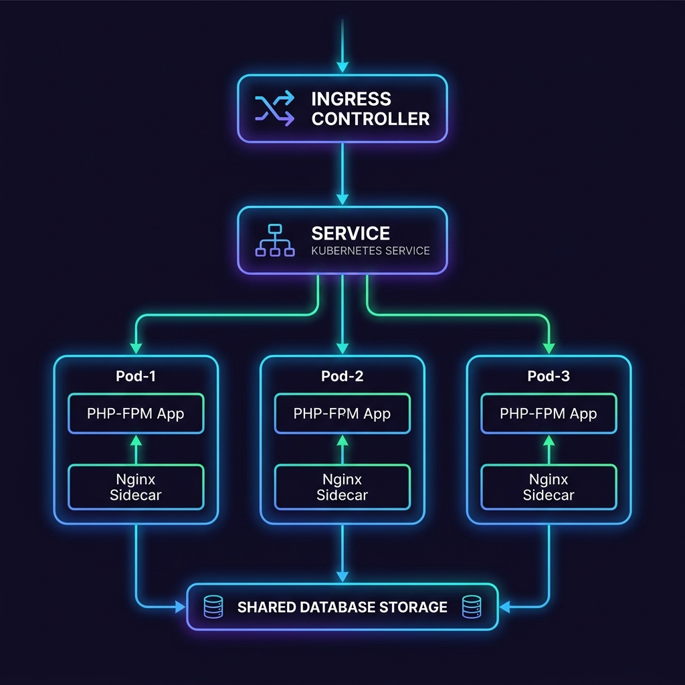

# Laravel on Kubernetes with Docker and Helm

This directory implements a containerized and horizontally scalable orchestration platform for a Laravel application running on **Kubernetes**. It utilizes a Docker multi-stage build, Docker Compose local simulator, and a full Helm Chart structure mapping pods (PHP-FPM + Nginx Sidecar), Ingress hosts, Secrets, and Autoscalers.

## 🏗️ Kubernetes Architecture

The architecture diagram below displays the cluster resource mapping.



### Architectural Components:
1. **Nginx Ingress Controller**: Entrypoint for all web traffic, terminating TLS/SSL certificates and proxying requests to the Application Service.
2. **Laravel App Service (ClusterIP)**: Internally routes requests to active app pods.
3. **Pod Architecture (Dual Container)**:
   - **`laravel-app` container**: Runs PHP 8.2-FPM. Handles the execution of business logic.
   - **`nginx-sidecar` container**: Standard Nginx reverse proxy serving static assets and redirecting PHP requests to the FPM engine over internal `127.0.0.1:9000`.
   - **Shared Volumetric Space**: An `emptyDir` mount holds files generated during building or uploaded by users, allowing both containers to read/write concurrently.
4. **Horizontal Pod Autoscaling (HPA)**: Automates replica changes based on live CPU and Memory limits (scaling from 3 to 10 replicas).

---

## 📦 Docker Architecture (Local Development)

For local development or testing environments, `docker-compose.yml` simulates the production environment by spawning the following containers:
- **`k8s-laravel-app`**: PHP-FPM application.
- **`k8s-laravel-nginx`**: Nginx web server routing traffic to app container.
- **`k8s-laravel-mysql`**: Local database engine.
- **`k8s-laravel-redis`**: Local Redis caching/queue engine.

Spin up the local development stack:
```bash
docker-compose up -d --build
```
Access the application locally at `http://localhost:8000`.

---

## 🚀 Deployment Steps (Kubernetes via Helm)

### 1. Prerequisites
- Access to a Kubernetes cluster (e.g. Minikube, EKS, AKS, or GKE).
- [Helm CLI](https://helm.sh/docs/intro/install/) installed.
- Ingress controller (like `ingress-nginx`) enabled on the cluster.

### 2. Configure Values
Adjust values under `helm/laravel-app/values.yaml` to specify target images, CPU/RAM resource quotas, and domain names.

### 3. Deploy Chart
Install the application using Helm:
```bash
helm install my-laravel ./helm/laravel-app --namespace production --create-namespace
```
Verify the generated resources:
```bash
kubectl get all -n production
```

---

## 📈 Autoscaling & Replicas

The **Horizontal Pod Autoscaler (HPA)** template configuration automates replica management.

- **Thresholds**:
  - Target CPU Limit: 70%
  - Target Memory Limit: 80%
  - Range: Min 3 pods, Max 10 pods.
- **Manual Scaling**: Override autoscaling to manually specify replicas:
  ```bash
  kubectl scale deployment/my-laravel-laravel-app --replicas=5 -n production
  ```

---

## 📊 Cluster Monitoring

Monitor active pods and compute loads using:
```bash
# Watch pod distributions
kubectl get pods -n production -w

# View HPA scaling statistics
kubectl get hpa -n production

# View application stdout/stderr logs
kubectl logs -f deployment/my-laravel-laravel-app -c laravel-app -n production
```
