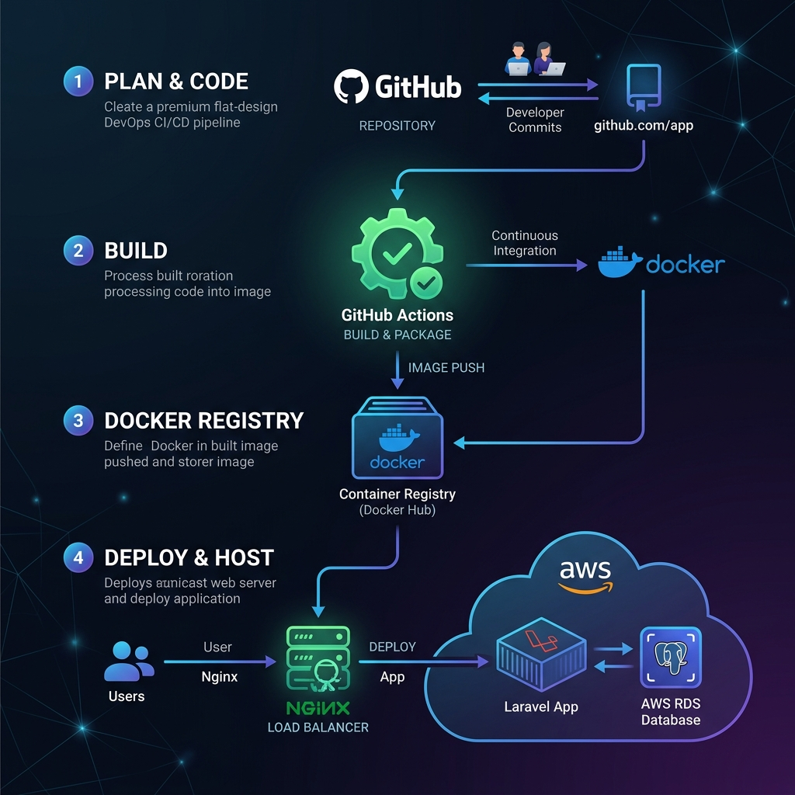

# Laravel DevOps: CI/CD & Zero-Downtime Deployment

This project demonstrates a production-grade DevOps setup for a Laravel application. It features automated containerization, a complete GitHub Actions CI/CD pipeline, security-focused Nginx configurations, and a symlink-based zero-downtime deployment flow.

## 🏗️ Architecture Diagram

Below is the conceptual architecture of the deployment flow. 



### Architecture Highlights:
1. **GitHub Actions**: Triggers linting, testing, and security scanning on every pull request. On pushes to `main`, it builds optimized Docker images and pushes them to the container registry, then initiates a deploy trigger via SSH.
2. **Docker Orchestration**: The application runs inside container environments (Nginx proxy, PHP-FPM application container, PostgreSQL database, and Redis cache).
3. **Zero-Downtime Releases**: Implements an atomic symlink-swapping deployment design. The Nginx server points to a `current` symlink. When a new deployment succeeds in `releases/YYYYMMDDHHMMSS`, the symlink is atomically changed, providing immediate switchover without dropped HTTP connections.

---

## 📁 Folder Structure

```text
laravel-devops-cicd/
├── .github/
│   └── workflows/
│       └── deploy.yml          # GitHub Actions CI/CD pipeline configuration
├── app/
│   └── Http/
│       └── Controllers/
│           └── HealthCheckController.php # App health & dependency monitoring
├── docker/
│   ├── nginx.conf              # Production Nginx server configuration
│   └── opcache.ini             # PHP OPcache optimization tweaks
├── routes/
│   └── web.php                 # Web routing registering health check APIs
├── scripts/
│   └── deploy.sh               # Bash script orchestrating zero-downtime symlinks
├── Dockerfile                  # Multi-stage production build Docker configuration
├── docker-compose.yml          # Docker Compose orchestration
└── README.md                   # Project documentation
```

---

## 🐳 Docker Setup

The containerized setup uses a **Multi-Stage Dockerfile** to minimize production image footprints and prevent compilers from being packed into the final image.

### Production Execution
Build and spin up the complete local environment:
```bash
docker-compose up -d --build
```
This boots:
- **App Container**: Running PHP 8.2-FPM on alpine.
- **Web Container**: Production-secured Nginx (`ports: 8080:80`).
- **Database Container**: PostgreSQL 15 alpine database.
- **Cache Container**: Redis 7 alpine caching layer.

---

## 🚀 GitHub Actions CI/CD Pipeline

The pipeline config file at `.github/workflows/deploy.yml` defines two core jobs:

1. **CI Suite (Tests)**:
   - Sets up PHP 8.2, configures dependency cache.
   - Installs Composer packages.
   - Executes PHPUnit test suites.
2. **CD Suite (Production Release)**:
   - Triggers only on merging to `main`.
   - Utilizes Docker Buildx to build and tag the production image.
   - Pushes build targets to Docker Registry.
   - Connects to target servers via SSH keys to reload the services and run migrations.

---

## 🔄 Zero-Downtime Deployment & Symlink Switching

To prevent traffic interruptions, deployments use atomic directories.

1. **Deploy Command**:
   ```bash
   chmod +x scripts/deploy.sh
   ./scripts/deploy.sh
   ```
2. **How it works**:
   - Creates a unique release directory `/var/www/app/releases/YYYYMMDDHHMMSS`.
   - Downloads/extracts the build target.
   - Binds configuration (`.env`) and user-media storage from the `/var/www/app/shared/` directory.
   - Optimizes class loaders, routes, and config caching.
   - Switches the active symbolic link:
     `ln -nfs /var/www/app/releases/YYYYMMDDHHMMSS /var/www/app/current`
   - Atomically reloads Nginx & PHP-FPM configs.

---

## ⏪ Rollback Strategy

In case of a failure in a newly released build:
1. SSH into the production server.
2. Point the symlink back to the previous release folder in the `releases/` directory:
   ```bash
   ln -nfs /var/www/app/releases/<PREVIOUS_RELEASE_TIMESTAMP> /var/www/app/current
   ```
3. Reload PHP-FPM and Nginx:
   ```bash
   sudo systemctl reload php8.2-fpm
   sudo systemctl reload nginx
   ```

---

## 📝 Production Checklist

- [x] Configure SSL certificates (e.g. Let's Encrypt / Cloudflare Edge).
- [x] Set environment parameter `APP_DEBUG=false`.
- [x] Use private subnets for DB/Redis containers.
- [x] Enforce rate-limiting on login/critical routes.
- [x] Enable automatic database backup schedules (GPG encrypted).
- [x] Set up log rotators to prevent storage filling up.
