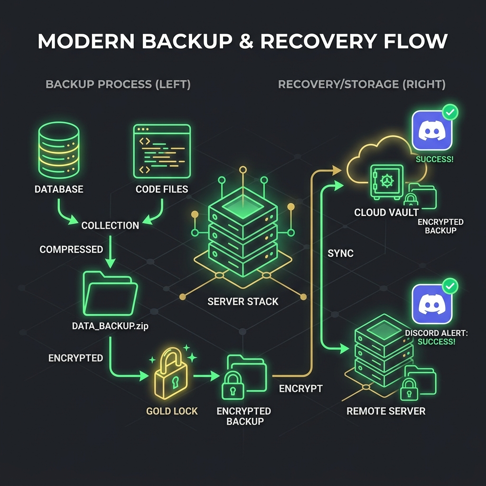

# Automated Linux Backup, Encryption & Alerts System

This repository provides a modular, production-ready backup automation engine for Linux systems. The script handles health validation, database dumps, directory zipping, symmetric encryption via GPG, secure sync over SSH/rsync to a backup server, automatic log rotation, and instant Discord/Slack notifications.

## 🏗️ Backup & Restore Flow Diagram

Below is the design layout representing our data pipeline.



### Core Highlights:
- **System Verification**: Checks the storage partition space prior to starting work. If disk capacity exceeds the threshold limit, the script aborts and sends an alert.
- **Security First**: The backup is symmetric-key encrypted via GPG. No raw database tables or source files are stored in plain text during remote transfers.
- **Instant Alerts**: Relies on Webhook payloads to notify engineers of deployment success or warning flags.

---

## 📁 Repository Structure

```text
linux-backup-automation/
├── config/
│   └── backup.conf.example   # Environment variables configuration template
├── cron/
│   └── backup-cron           # Cron schedule configurations
├── logrotate/
│   └── backup-logrotate      # Log rotation configs for backup.log
├── scripts/
│   ├── backup.sh             # Main backup scripting utility
│   └── restore.sh            # Restoring/decryption tool
└── README.md                 # Project documentation
```

---

## ⚙️ How to Configure

1. Copy the example configuration profile:
   ```bash
   cp config/backup.conf.example config/backup.conf
   ```
2. Modify `config/backup.conf` with your database credentials, source directories, encryption passphrases, target remote host, and Discord webhook credentials.

---

## 🚀 Execution & Restore Processes

### Running a Backup
Make the script executable and trigger the backup manually:
```bash
chmod +x scripts/backup.sh
./scripts/backup.sh
```
Logs will print to stdout and log directly to `/var/log/backup.log`.

### Restoring from Backup
Use the recovery tool to decrypt and restore:
```bash
chmod +x scripts/restore.sh
./scripts/restore.sh
```
This interactive utility will:
1. Ask you for the target backup folder path.
2. Prompt for the GPG decryption passphrase.
3. Extract source file directories to their destination.
4. Import database tables back to the active engine.

---

## ⏰ Cron Schedules & Automation

Inject schedules into cron using:
```bash
crontab cron/backup-cron
```
The schedule performs:
- **Backup Execution**: Triggered daily at 2:00 AM.
- **Hourly Disk Check**: Verifies partition limits; pushes warnings to Slack/Discord on overflow.

---

## 🧹 Log Rotation Config

To prevent `/var/log/backup.log` from exhausting VPS storage, copy the logrotate configuration:
```bash
sudo cp logrotate/backup-logrotate /etc/logrotate.d/backup
```
This rotates logs weekly, keeping a historical depth of 4 weeks, with automatic compression.
