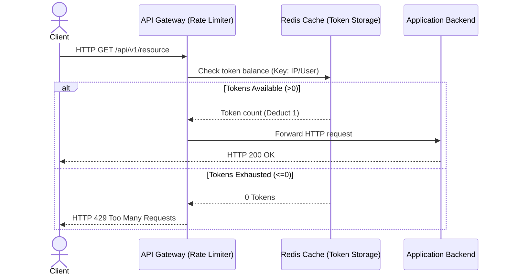
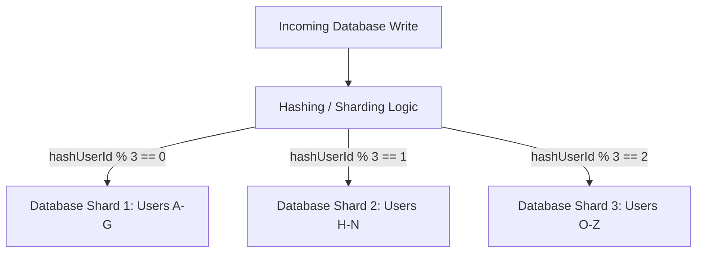
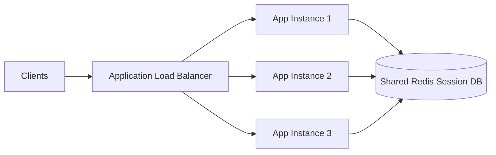
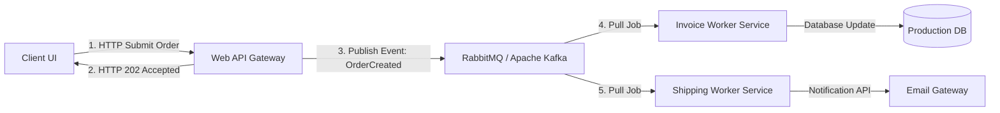

# System Design Blueprints & Architectural Notes

This directory houses conceptual system design blueprints, scalability strategies, and architectural notes for high-performance enterprise applications.

---

## 🛡️ 1. API Rate Limiting (Token Bucket Pattern)

Rate limiters protect server resources from exhaustion, denial of service (DoS) attacks, and brute force requests.

### Core Concepts:
- **Refill Rate**: Tokens are continuously added to the bucket at a constant rate (e.g. 10 tokens per minute).
- **Burst Capacity**: If the bucket is full, the client can make a burst of requests equal to the maximum bucket size instantly.
- **Storage Layer**: Utilizes Redis for high-speed counter operations with Time-To-Live (TTL) keys.

---

## 🗄️ 2. Database Sharding & Partitioning

Sharding distributes data horizontally across multiple independent database engines (shards) based on a partition key to scale storage write throughput.

### Scaling Strategies:
- **Horizontal Partitioning**: Splitting database tables row-wise across multiple servers.
- **Vertical Partitioning**: Splitting columns (e.g. separating user profile blobs from credentials fields).
- **Reconciliation**: Transactions that span multiple shards require complex coordinates like 2-Phase Commits (2PC) or Sagas.

---

## ⚖️ 3. Horizontal Scaling & Load Balancing

Horizontal scaling adds more application servers to a resource pool instead of increasing the CPU/RAM of a single host.

### Key Considerations:
- **Stateless Backend**: Session information must not be stored inside local container memory. It is externalized to Redis or Memcached to make servers interchangeable.
- **Health Verification**: Load balancers verify servers' readiness endpoints dynamically to drop failing hosts from active routing.

---

## ✉️ 4. Event-Driven Architecture (Message Queues)

Decoupling synchronous API calls via asynchronous messaging queues prevents slow dependencies from clogging client threads.

### Advantages:
- **Asynchronous Execution**: The API returns an immediate response (`202 Accepted`) to the client, handling resource-heavy tasks like invoice generation or shipping assignments in the background.
- **Traffic Spikes Defusal (Throttling)**: Workers pull jobs at their own pace, preventing database connection limits from crashing during high-sales events.
