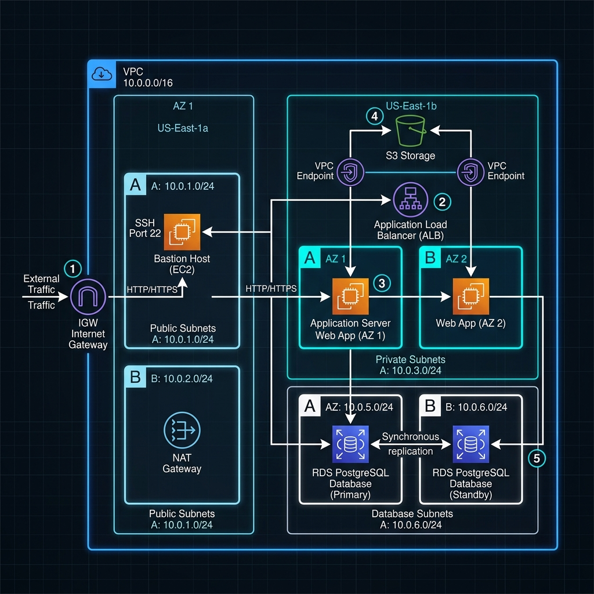

# AWS Two-Tier Cloud Infrastructure via Terraform

This repository provisions a secure, multi-tier AWS infrastructure using **Terraform**. It establishes a private Virtual Private Cloud (VPC), segregated public/private subnets, Bastion host setup for administrative access, secure S3 object storage with KMS encryption, IAM instance profile access, and a multi-AZ PostgreSQL RDS database instance.

## 🏗️ Architecture

Below is the design layout of the provisioned AWS resources.



### Design Highlights:
- **Network Isolation**: Direct public access is blocked for compute (app servers) and databases. Compute nodes live in Private Subnets, and databases live in isolated Database Subnets.
- **Bastion Gate**: SSH access to private instances is restricted via SSH Key Pairs and only accessible by establishing tunnels through a Bastion Host positioned in a Public Subnet, locked down to specific administrative IPs.
- **S3 Access**: The app server reads/writes private bucket objects via an IAM Role using the AWS Instance Profile instead of long-lived access key credentials.

---

## 📦 Terraform Modules

The setup is organized into modular directory components to follow the DRY (Don't Repeat Yourself) principle:

- **`vpc`**: Sets up VPC, internet gateways, elastic IPs, NAT gateway, public/private subnets, and route tables.
- **`ec2`**: Provisions public Bastion and private Application EC2 instances, security groups, and user-data boot-scripts to provision docker services.
- **`rds`**: Launches a secure, private Multi-AZ PostgreSQL database.
- **`s3`**: Generates private S3 buckets with Server-Side Encryption (SSE) and object lifecycle configurations.
- **`iam`**: Builds IAM Roles, Instance Profiles, and least-privilege security policies.

---

## ⚙️ Variables

The project accepts customization parameters through `variables.tf`. A complete sample is provided at `terraform.tfvars.example`. Key settings:

| Name | Type | Description | Default |
| :--- | :--- | :--- | :--- |
| `aws_region` | `string` | AWS region to deploy resources | `us-east-1` |
| `environment` | `string` | Tag prefix identifier (e.g. prod, staging) | `prod` |
| `key_name` | `string` | EC2 SSH keypair name for login | *(Required)* |
| `allowed_admin_ips` | `list(string)` | Whitelist CIDR blocks for Bastion SSH | `["0.0.0.0/0"]` |
| `db_password` | `string` | Master database administrator password | *(Required/Sensitive)* |

---

## 📤 Outputs

Important endpoints and attributes are returned by `outputs.tf` upon deployment completion:

- `vpc_id`: The ID of the primary VPC.
- `bastion_public_ip`: Public IP of the Bastion gateway server.
- `app_private_ip`: Internal IP of the App server.
- `db_endpoint`: PostgreSQL connection host endpoint.
- `s3_bucket_name`: Unique generated bucket name.

---

## 🚀 Deployment Steps

### 1. Prerequisites
- Install [Terraform CLI](https://developer.hashicorp.com/terraform/downloads) (>= 1.5.0).
- Configure AWS credentials:
  ```bash
  aws configure
  ```

### 2. Initialization
Initialize the backend and download provider plugins:
```bash
terraform init
```

### 3. Plan Validation
Create a variable definition file `terraform.tfvars` from the template and run:
```bash
terraform plan -out=tfplan
```
Review the printout to inspect the 15+ cloud resources scheduled for creation.

### 4. Apply Changes
Provision the cloud infrastructure:
```bash
terraform apply tfplan
```

---

## 🗑️ Destroy Steps

To clean up resources and prevent unexpected charges:
```bash
terraform destroy
```

---

## 💰 Cost Estimation (Monthly Budget)

Below is a cost projection for the resources spawned by this stack under the standard AWS Free Tier or base configurations:

| Resource | Service Tier | Unit Monthly Price | Total Expected |
| :--- | :--- | :--- | :--- |
| VPC NAT Gateway | 1 Gateway | ~$32.85 | $32.85 |
| EC2 App Instance | `t3.medium` (4GB RAM) | ~$30.36 | $30.36 |
| EC2 Bastion Host | `t3.micro` (1GB RAM) | ~$8.46 | $8.46 |
| RDS PostgreSQL | `db.t3.micro` (Single-AZ) | ~$12.41 | $12.41 |
| S3 Storage | 50 GB storage + requests | ~$1.20 | $1.20 |
| **Total Est.** | | | **~$85.28 / month** |
